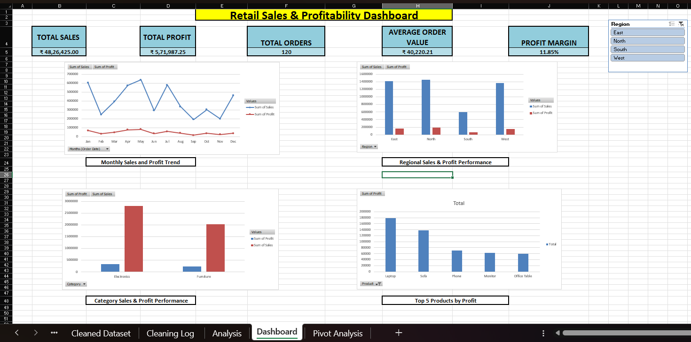

# 📊 Retail Sales & Profitability Analysis Dashboard — Excel

## 📌 Project Overview

This project analyzes retail sales and profitability data using Microsoft Excel to transform raw transactional data into actionable business insights.

The analysis covers product, category, regional, customer and monthly performance, culminating in an interactive Excel dashboard designed to support business decision-making.

---

## 🎯 Business Objectives

- Identify high-performing regions and categories
- Analyze product-level sales and profitability
- Identify valuable customers
- Understand monthly sales and profit trends
- Identify underperforming products and regions
- Develop actionable business recommendations

---

## 🛠️ Tools & Techniques

- Microsoft Excel
- Data Cleaning
- Excel Formulas
- XLOOKUP
- SUMIF / COUNTIF
- Pivot Tables
- KPI Analysis
- Profit Margin Analysis
- Data Visualization
- Interactive Slicers
- Dashboard Development

---

## 🔍 Analysis Performed

The project analyzes:

- Regional performance
- Category performance
- Product profitability
- Customer contribution
- Monthly sales and profit
- Region × Category performance
- Top product profitability

---

## 📈 Dashboard Preview

## 📥 Project Files

[Download the complete Excel workbook](Retail_Sales_Profitability_Analysis.xlsx)

---

## 💡 Key Business Insights

### 🌎 Regional Performance

- North is the strongest-performing region based on overall sales and profit.
- South is the weakest-performing region.
- East is particularly strong in Electronics sales.

### 📦 Category Performance

- Electronics is the strongest category in terms of overall sales and profit.
- Furniture has comparatively lower overall sales and profit.

### 🏆 Product Performance

- Laptop is the strongest overall product performer based on sales and profit.
- Monitor represents a potential growth opportunity due to relatively strong profitability but lower sales.
- Office Chair requires profitability investigation due to its relatively low margin.

### 👥 Customer Performance

- Priya Mehta is the highest-value customer based on total sales and profit.
- Vikas Jain has the highest number of orders.

### 📅 Monthly Performance

- May records the highest monthly sales and profit.
- September records the lowest monthly sales and profit.

---

## 💼 Business Recommendations

1. Protect and scale high-performing products.
2. Investigate high-margin products with comparatively lower sales.
3. Review pricing and cost structure for low-margin products.
4. Investigate the causes of regional underperformance.
5. Use targeted promotional strategies instead of blanket discounting.
6. Prioritize retention and personalized engagement for high-value customers.

---

## ⚠️ Data Quality Considerations

During data cleaning, duplicate records, inconsistent text, incorrect data types and missing values were identified.

Two transactions contained incomplete financial information:

- ORD1046 — missing Sales
- ORD1053 — missing Profit

These values were not arbitrarily estimated because reliable source information was unavailable.

---

## 📊 Project Outcome

The project transformed raw retail transaction data into an interactive management dashboard containing:

- KPI cards
- Monthly sales and profit trend
- Regional performance comparison
- Category performance comparison
- Top 5 products by profit
- Interactive region slicer
- Executive business insights

---

## 👩‍💻 Author

**Shivani Sethi**

MBA — Business Analytics

This project is part of my ongoing Business Analytics portfolio and learning journey.

